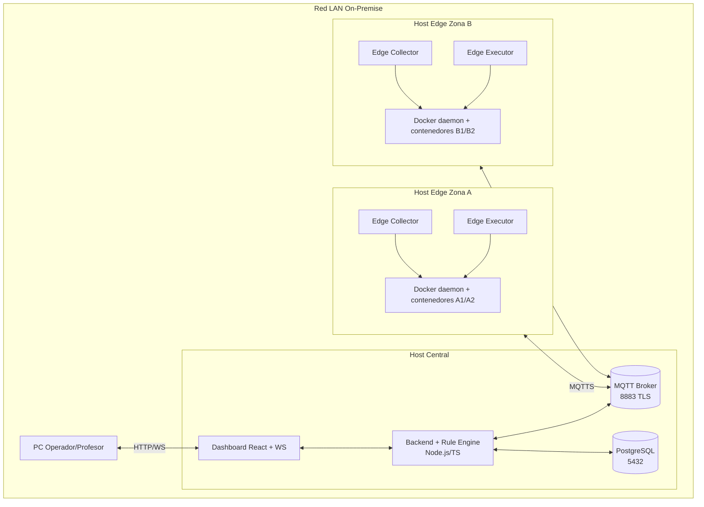

# Diagramas de Arquitectura SEDCM (Mermaid)

Este archivo contiene los diagramas base para el MVP descrito en la documentacion tecnica.

## 1) Diagrama de Componentes (MVP)

```mermaid
flowchart LR
  subgraph ZA[Zona A - Edge Node]
    ALOAD[Nodos de carga Docker\n(emuladores CPU/RAM/Net I/O)]
    AENV[Simulador ambiente Rack\n(temperatura/humedad)]
    ACOL[Edge Collector\nPython]
    AEXE[Edge Executor\nPython]
    ALOAD --> ACOL
    AENV --> ACOL
  end

  subgraph ZB[Zona B - Edge Node]
    BLOAD[Nodos de carga Docker\n(emuladores CPU/RAM/Net I/O)]
    BENV[Simulador ambiente Rack\n(temperatura/humedad)]
    BCOL[Edge Collector\nPython]
    BEXE[Edge Executor\nPython]
    BLOAD --> BCOL
    BENV --> BCOL
  end

  subgraph CP[Servidor Central - Control Plane]
    MQTT[Broker MQTT\nMQTTS/TLS]
    API[Backend Node.js/TypeScript\nMotor de reglas]
    DB[(PostgreSQL\nInventario + Telemetria + Auditoria)]
    WS[WS Gateway]
    UI[Dashboard React]
    MQTT --> API
    API --> DB
    API --> WS
    WS --> UI
  end

  ACOL -- publica telemetria --> MQTT
  BCOL -- publica telemetria --> MQTT
  API -- publica comandos --> MQTT
  MQTT -- comandos por zona/rack --> AEXE
  MQTT -- comandos por zona/rack --> BEXE
  AEXE -- ACK --> MQTT
  BEXE -- ACK --> MQTT
```

## 2) Diagrama de Despliegue LAN On-Premise



## 3) Namespace MQTT recomendado para el primer spec

```text
dc/telemetria/zona/{Z}/rack/{R}/nodo/{N}
dc/telemetria/zona/{Z}/rack/{R}/ambiente
dc/control/zona/{Z}/rack/{R}
dc/ack/zona/{Z}/rack/{R}/nodo/{N}
dc/eventos/alertas
```

## 4) Flujo minimo para criterios de aceptacion (primer spec)

1. Edge Collector publica telemetria de nodo y ambiente.
2. Backend evalua reglas y cambia estado (Normal -> Critico).
3. Backend publica comando soft_reboot.
4. Edge Executor ejecuta accion y responde ACK.
5. Si no recupera en ventana definida, Backend escala a hard_shutdown.
6. Dashboard recibe cambios por WebSockets sin refrescar pagina.
